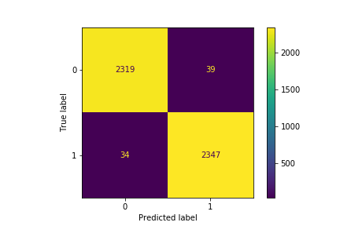

#  Project 3: Reddit NPL Challenge

### Problem Statement
---

Virtual assitants are no new words for us nowadays. We can see them everywhere from when we do online shopping, access to our bank accounts, or just at your fingertips, your smartphone. These virtual assistants are very helpful in perform specific tasks, however one thing is something: a personal touch. Intended for product managers of virtual assistants, this project sets out to build a classifier that is able to tell an intended joke from the sharing of a personal story. It aims to lay a foundation for further studies in training computers to be more empathetic, so that organization would be able to use virtual assitants to establish a stronger emotional bond with their customers, and benefit from increased customer loyalty in the long run. 

### Data Selection and Fetching
---

The data comes from two subreddit groups on Reddit.com, r/Jokes and r/TalesfromRetail. The reasons to pick these two subreddits include: 1. they are similar in the way that they both, in most cases, funny; 2. they are different in intentions and structures, with jokes are intended to entertain and usually come with a punch line whearas tales from retails are focused on sharing and thus have a looser language structure.

I used the Pushshift API as a tool to retrieve the data. My goal is to retrieve around 10,000 posts for each subreddit. However Pushshift has a limit of 100 posts per request, I would need multiple requests to retrieve enough data for my models, let alone screening through unqualified ones. Therefore I built a function to automate this process, which achieved the following: 1. to retrieve the posts based on the subreddit name and total posts that I input; 2. to concatenate all the posts retrieved per each subreddit into one dataframe; 3. to drop the posts that have been removed by moderators/users and thus show no selftext in the system. The function allows me to pull all the data I needed in two commands -- one for each subreddit. I ended up retrieving 10,008 non-removed data from r/Jokes and 10,030 from r/TalesfromRetail.

I also set the latest post to be 10/10/2020 midnight PDT, which is one week before the time the data is being retrieved. I did this because I believe posts with certain "age" may be a better representation of the subreddits since the new posts are usually subject to certain inspections by reddit and tend not have enough interactions(comments, upvotes, etc).

### Data Cleaning
---
As I dropped all the "removed" posts during my data fetching stage, I was able to get the datasets for both subreddits with very few null values in selftext: 3 in r/Jokes and 2 in r/TalesfromRetail compared to over 10k rows of data. I therefore dropped these null value rows believing they would not have significant impact on my data. During this process I also came across some other unavailable rows with "deleted" selftext, which escaped the screening in my data fetching, so I dropped these rows as well. Lastly, I dropped the duplicated rows.

### Feature Engineering & Selection
---
Feature engineering in this project is mainly for EDA purposes, with the goal to understand the context of both subreddits, which I believe will help greatly in understanding and interpreting modeling results. Therefore I created some features including: "word counts", "character counts" to examine the length of the texts in each subreddit, "age" to examine the length of time posts were in the subreddits, "text" to concatnate the title and selftext for modeling. I also had a couple features as a result of sentiment analysis, which will discuss in details in EDA section.

The feature selection for this project is relatively straightforward -- using the text feature that I created as the source of natural language processing. The target is the "subreddit" feature and in my project I used r/Jokes as 1 and r/TalesfromRetail as 0.

### Data Dictionary
---

The data dictionary below contains the features in the clean datasets for this project.

|Feature|Type|Dataset|Description|
|---|---|---|---|
|**author**|*object*|jokes/tales|author of the post|
|**title**|*object*|jokes/tales|title of the post|
|**selftext**|*object*|jokes/tales|text of the post|
|**score**|*integer*|jokes/tales|score by the time Pushlift API captured the post(not updated)|
|**num_comments**|*integer*|jokes/tales|number of comments for the post|
|**upvote_ratio**|*float*|jokes/tales|ratio of upvote over downvote|
|**created_utc**|*integer*|jokes/tales|post created time in utc integer format|
|**subreddit**|*object*|jokes/tales|subreddit group each post belongs to|
|**text**|*obejct*|combined|combined text of title and selftext for each post|
|**word_count**|*integer*|jokes/tales|word counts for each post|
|**char_count**|*integer*|jokes/tales|character counts for each post|
|**age**|*integer*|jokes/tales|length of time from when each post was created to being retrieved|
|**sentiment**|*float*|combined|sentiment score for each post|
|**sentiment_cat**|*object*|combined|categorical result for sentiment score (scale: negative, neutral, positive)|

### Exploratory Data Analysis
---
The EDA in this project provided great insights in understanding the modeling results. The EDA I performed could be broken down to four parts: individual subreddit EDA; combined EDA; top words with and without stopwords; sentiment analysis. Some key takeaways from the EDA are as follows:

1. r/TalesfromRetail posts are in general longer than r/Jokes

2. r/Jokes posts are more recent while r/TalesfromRetail posts are more spread out and go as early as more than 2 years ago.

3. Stopwords make great difference in showing words frequency. I also realized the necessity of creating my custom stop words during the EDA since the built-in stop words lists from sklearn or nltk library both consider "I" as a stop word, however for my project, it could be a good way to distinguish a personal story and what not.

- Without Stopwords

- With Stopwords

3. From the sentiment analysis, it is interesting to find that r/TalesfromRetail tends to have more extreme sentiment in posts as with very few neutral were identified, whearas r/Jokes subreddit has sentiment results more evenly distributed.

### Modeling & Best Model Selection
---

Including the baseline model, I ran 8 models for this project. For each non-baseline model, I used either CountVectorizer or TfidfVectorizer to preprocess my data, using custom stop words and token pattern so that I can include "I" in the features as discussed in the EDA section. I used grid search to find the optimal parameters for logistic regression, K-nearest neighbors, naive bayes, random forest, and extra trees models. Due to the limited capacity of my computer, I did not have the luxury to test out thousands of fits for each model. As a strategy, I decided to fine tune models as I proceeded. Therefore, each model, even though with different methodology, is a little dependant from the previous one. For instance, I started with the logistic regression model with max features of 10,000 to 30,000, among other parameters. When 10,000 features return the optimal result, I then optimize for a lower number of max features and found 2,000 and 4,000. Therefore 2,000 and 4,000 became my benchmark for all the models I run afterwards. I didn't even bother to test 10,000 anymore. Same thing happend to vectorizers. I started by using both vectorizers and as I realized TfidfVectoirzer performs better on my dataset, I decide to drop CountVectorizer on the later models.

In all models that I performed, I was able to beat the baseline model by significant amount. The top 2 highest accuracy came both from logistic regression, at 99% and 98.5%, however the number of max features used in the highest performing model is 4,000 as compared to 2,000 for the second. 

There are four criteria for me to select the best model:
- Accuracy: I would of course like my virtual assistants to classify the correct subreddit so as to have the correct output.
- Specificity: However, if there are any misclassifications, it would be better to classify jokes as tales vs the other way around because the latter would likely to have adverse effect on people's emotions.
- Feature Numbers: As an average english speaker has a vocabulary of around 20,000 words, by having too many features in my model are not an indicator of good performance. Therefore I would like to select the model with leanest features.
- Computational Costs: Holding everything else constant, if a model can run a lot faster than another, it would definitely be more preferable because it saves engergy and costs. Among my models, some faster models have even better accuracy result.

With those in mind, I selected my second best performing model, which used logistic regression with TfidfVectorizer as my best model to evaluate. The logistic regression model also comes with great interpetability, which provides me with extra insights into my data.

### Evaluation
---

The best model selected has a high accuracy rate of 98.5% and high specificity rate of 98.3%. It uses max features of 2,000 and took 16 minutes to fit 120 models. I can conclude from the confuxion metrics as below that this is a very well performing model.

By looking deeper into the prediction of distribution, I noticed that my model predictions tend to be very extreme, which may be an indicator of major distinction between two subreddits, which is a departure from what I have hypothesized. Further studies that suggest statistic significantce could be applied to validate my hypothesis.

### Findings
---

The findings look at two parts: the misclassifications and significant features.

There are 73 misclassifications in the testing data with 39 as false positive and 34 as false negative. I used sentiment analysis along with stats as tools to help me understand from the perspective of the computer.

23 of the false positive results are identified as having positive sentiment. These are the posts that despite not jokes, that will not alienate users. However for the 16 negative sentiment posts, I found out that they were actual rants/complaints about things happen at retail work. These are the ones that more focus should put into to avoid misclassification. 8 of the false negative predictions have neutral sentiment, which should be a good indicator for jokes, since most tales have stronger emotions. The other pattern I have observed based on the misclassification texts is that most misclassified r/TalesfromRetail posts are in shorter format whearas most misclassified r/Jokes posts are longer. This may indicate that my model tends to classify longer texts to be from r/TalesfromRetail and shorter texts from r/Jokes.

From the below most significant features for both subreddits, I found that for r/Jokes, roles/professions account for many in the lists, including: "wife", "father", "doctor", "priest", "bartender", and "president". Second pattern is some potential sexual words, i.e. "sex", "bed", "bar", (might even "wife", "man"), etc. The third pattern would be more in-trend words, including "trump", and "covid", this might be a result of the fact that posts from r/Jokes retrieved are more recent. As for r/TalesfromRetail, most significant features are without surprise retail terms, including "items", "registers", "shop", "card", "retail", "manager", "store", "customer(s)", "manager" and also interestingly phrase "i work".

### Conclusion
---
In conclusion, the logistic regression model vectorized by TfidfVectorizer is the best model for this classification problem. The model has an almost perfect accuracy rate of 98.5% and similar high sensitivity and specificity rate. Besides the fact that I was able to optimize the model to a good extent, it is also likely that the two subreddits are distinctive enough to be classified easily by the model, although in my hypothesis, the two subreddits should be hard to differentiate. In addition, the model also tends to classify based on the length of the texts.

Based on the findings, one of the key identifiers of Jokes are words as roles or professions, as Tales are usually from first person's perspective. Second are sexual-related words. Also people tend to make jokes of current events, which could also be a strong indicator of Jokes. Key identifiers of Tales are not surprisingly retail-related terms such as shop, store, customer, manager and register. Notably "I work" is also an important feature as this is usually people tells their own story.

The model could be improved even more if it could decrease classifying posts with negative sentiments as jokes, as this would alienate people's feeling when they are looking for ranting.

### Limitations & Future Studies
---

Without doubt, there are several limitations of the project. To start with, the data cleaning could be done more thoroughly. In the later stage of the project, I started to realize that there are some https links mixed in the posts, which never occured to me as I was not a Reddit user and was not familiar with its content structure. This results in hyperlink keywords like "https" and "com" show up as significant features in TalesfromRetail. It is also the case with "gt", a format code in html texts which stands for "greater than", which occurs when the text in the post was pasted from somewhere else without reformatting. "gt" also shows up in the top 20 significant features. So for my next step, I would like to focus doing a more thorough data cleaning to increase the legitimacy of posts and thus increasing the model. 

Secondly, the texts were not lemmatized before vectorization, which led to some repetitive features, i.e."customer" and "customers" are both in the top 20 significant features for tales. In my future studies, I would like to explore how to effectively incorporate lemmatize into the pipeline. 

In addition, sentiment analysis seems to be of great help in effectively diminishing the false positive. I would like to explore in the future how to use sentiment analysis as a feature along with the word features in modeling.

Last but not least, one of the target subreddit TalesfromRetail has a strong focus on retail therefore making it easier for the model to classify between two subreddits. However to scale the result, more data other than those from retail should be examined to mitigate the influence of retail terms.